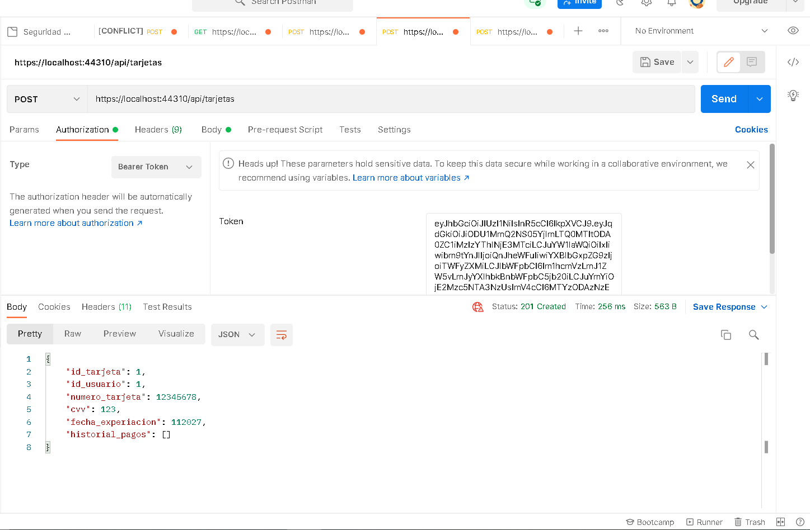

# ApiSeguridadBMBConJWT
Api creada para resultados de evaluación de aprendizaje unidad 2 y 3 de Seguridad. Con algoritmos de cifrados, protocoló de seguridad, certificados digitales y JWT.

# Flujo básico de funcionalidad
### Primeramente, como se observa en la imagen, se crea un usuario. En esta petición POST se puede apreciar la encriptación de la contraseña a BASE64.

* Es importante mencionar que las clases para encriptar a SH256 y MD5 también se encuentran existentes. Aunque su funcionalidad no está implementada seria fácil realizar lo mencionado.
* La desencriptación de igual manera esta para base64 esto se aprecia mejor más adelante en la captura del LOGIN.

### Se puede apreciar que en la siguiente imagen no permite realizar la petición POST de la tarjeta por la falta del TOKEN.

### Por lo que se debe iniciar sesión con el método POST y las credenciales correctas para que se genere el correspondiente TOKEN de acuerdo a los datos del usuario.
* Aquí sucede la desencriptación de BASE64 y se comparar las contraseñas.
* _Si se desea realizar la comparación de SH256 y MD5 se debe encriptar la contraseña ingresada por el usuario y comparar las encriptaciones. Ya que estos métodos no manejan desencriptación._

### Se realiza la prueba para agregar la tarjeta ya con el TOKEN y se demuestra su correcto funcionamiento.

## Verificación de protocolos de seguridad `HTTPS` y certificado `SSL`

# Referencias 
* Os Hub. (2020, 5 noviembre). How to Create a Self-Signed Certificate in Windows with PowerShell? Windows OS Hub. http://woshub.com/how-to-create-self-signed-certificate-with-powershell/
* HearTom. (2017, 12 junio). Crear Web Api con Entity Framework [Vídeo]. YouTube. https://www.youtube.com/watch?v=TbKuHOjRFno
* Acosta, R. (2019). JSON Web Token - Seguridad en servicios Web API 2 de ASP.NET. Rafael Acosta { .NETdeveloper; }. https://www.rafaelacosta.net/Blog/2019/6/17/json-web-token-seguridad-en-servicios-web-api-2-de-aspnet
